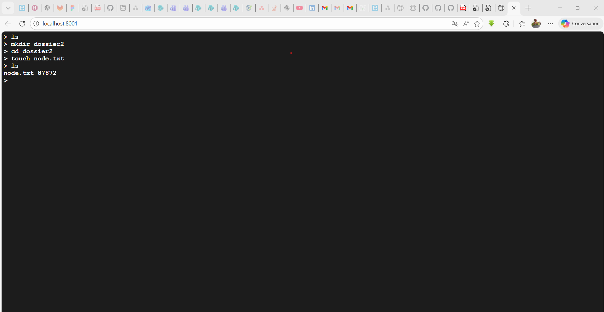

# Explorateur de Fichiers - TD2 POO (FISA 3A)

## Etudiant : SESSOU Winsou Richard
## Description

Ce projet implémente un explorateur de fichiers en ligne de commande similaire à un terminal Unix. L'application permet de naviguer dans une arborescence de fichiers et de dossiers, de créer des fichiers et des dossiers, et de lister le contenu des répertoires. L'application propose deux interfaces utilisateur : une interface terminal classique et une interface web accessible via un navigateur.

## Architecture

Le projet suit une architecture en couches bien définie, respectant les principes de la programmation orientée objet :

```
com.esiea.pootd2/
├── models/          # Modèles de données (Inode, FileInode, FolderInode)
├── commands/        # Commandes (Command, ListCommand, etc.)
│   └── parsers/    # Parseurs de commandes
├── controllers/     # Contrôleurs (ExplorerController)
└── interfaces/     # Interfaces utilisateur (TextInterface, HttpInterface)
```

### Structure des Packages

#### 1. **Models** (`com.esiea.pootd2.models`)
Représente la structure de données du système de fichiers :

- **`Inode`** : Classe abstraite représentant un nœud du système de fichiers
  - Attributs : `name`, `parent`
  - Méthodes : `getName()`, `getSize()`, `getParent()`, `setParent()`

- **`FileInode`** : Classe représentant un fichier
  - Hérite de `Inode`
  - Taille générée aléatoirement entre 1 et 100000

- **`FolderInode`** : Classe représentant un dossier
  - Hérite de `Inode`
  - Contient une liste d'enfants (`children`)
  - Taille calculée comme la somme des tailles de ses enfants
  - Méthode `addInode()` pour ajouter des fichiers/dossiers

#### 2. **Commands** (`com.esiea.pootd2.commands`)
Implémente le pattern Command pour représenter les actions utilisateur :

- **`Command`** : Classe abstraite vide (selon le cahier des charges)

- **`ListCommand`** : Commande pour lister le contenu du dossier courant

- **`ChangeDirectoryCommand`** : Commande pour changer de répertoire
  - Prend un chemin en argument (ex: `".."`, `"/"`, `"nomDossier"`)

- **`MakeDirectoryCommand`** : Commande pour créer un dossier
  - Prend un nom en argument

- **`TouchCommand`** : Commande pour créer un fichier
  - Prend un nom en argument

- **`ErrorCommand`** : Commande pour représenter les erreurs
  - Contient un message d'erreur

#### 3. **Parsers** (`com.esiea.pootd2.commands.parsers`)
Gère la traduction des commandes textuelles en objets Command :

- **`ICommandParser`** : Interface définissant la méthode `parse(String)`

- **`UnixLikeCommandParser`** : Implémentation du parser
  - `parse(String)` : Méthode principale qui transforme une String en Command
  - `splitArguments(String)` : Sépare les arguments de la ligne de commande
  - `mapCommand(List<String>)` : Transforme la liste d'arguments en Command appropriée
  - Gère les erreurs en retournant des `ErrorCommand`

#### 4. **Controllers** (`com.esiea.pootd2.controllers`)
Contrôle la logique métier et coordonne les opérations :

- **`IExplorerController`** : Interface définissant `executeCommand(String)`

- **`ExplorerController`** : Implémentation du contrôleur
  - Gère le dossier racine (`root`) et le dossier courant (`currentFolder`)
  - Utilise un `ICommandParser` pour parser les commandes
  - Méthodes `doCommand()` surchargées pour chaque type de Command :
    - `doCommand(ListCommand)`
    - `doCommand(ChangeDirectoryCommand)`
    - `doCommand(MakeDirectoryCommand)`
    - `doCommand(TouchCommand)`
    - `doCommand(ErrorCommand)`
  - Utilise `instanceof` pour déterminer le type de commande

#### 5. **Interfaces** (`com.esiea.pootd2.interfaces`)
Gère l'interaction avec l'utilisateur :

- **`IUserInterface`** : Interface définissant la méthode `run()`

- **`TextInterface`** : Implémentation de l'interface utilisateur en mode texte
  - Prend un `IExplorerController` en paramètre dans le constructeur
  - Lit les commandes depuis `stdin`
  - Affiche les résultats
  - S'arrête quand l'utilisateur tape `"exit"`

- **`HttpInterface`** : Implémentation de l'interface utilisateur en mode web
  - Prend un `IExplorerController` en paramètre dans le constructeur
  - Démarre un serveur HTTP sur le port 8001
  - Fournit une interface web accessible via navigateur
  - Gère les requêtes GET (affichage de l'interface) et POST (exécution des commandes)
  - S'arrête quand l'utilisateur tape `"exit"` dans l'interface web

- **`AbstractInterface`** : Classe abstraite de base pour les interfaces
  - Contient le contrôleur commun à toutes les interfaces
  - Implémente `IUserInterface`

## Diagramme de Classe

Un diagramme de classe UML représentant l'architecture complète du projet est disponible dans le fichier `TD2_diagramme.drawio.svg`. Ce diagramme a été créé avec [draw.io](https://app.diagrams.net/) et illustre les relations entre les différentes classes, interfaces et leurs méthodes.

## Compilation et Exécution

### Compilation

```bash
javac -d out/production/TD2 com/esiea/pootd2/**/*.java
```

### Exécution

```bash
java -cp out/production/TD2 com.esiea.pootd2.ExplorerApp
```

## Utilisation de l'Application

### Démarrage

Lors du lancement de l'application, un menu interactif s'affiche dans la console vous permettant de choisir le type d'interface :

```
Choisissez l'interface utilisateur :
  1. text - Interface terminal
  2. http - Interface web (http://localhost:8001)
Votre choix (text/http) : 
```

Vous pouvez saisir :
- `text` ou `1` pour utiliser l'interface terminal
- `http` ou `2` pour utiliser l'interface web

### Interface Terminal

L'interface terminal fonctionne directement dans votre console. Après avoir sélectionné l'option `text`, vous pouvez commencer à saisir des commandes immédiatement.

**Caractéristiques :**
- Affichage en temps réel dans la console
- Prompt `>` pour indiquer qu'une commande peut être saisie
- Résultats affichés directement sous chaque commande
- Tapez `exit` pour quitter l'application

**Exemple d'utilisation :**
```
> ls
> mkdir monDossier
> cd monDossier
> touch fichier.txt
> ls
fichier.txt 54321
> exit
```

### Interface Web

L'interface web permet d'utiliser l'explorateur de fichiers via un navigateur web. Après avoir sélectionné l'option `http`, un serveur HTTP démarre automatiquement.

**Caractéristiques :**
- Accessible à l'adresse `http://localhost:8001`
- Interface graphique similaire à un terminal dans le navigateur
- Fond sombre avec texte blanc pour une meilleure lisibilité
- Les commandes sont envoyées via des requêtes HTTP POST
- Tapez `exit` dans l'interface web pour fermer le serveur

**Étapes d'utilisation :**
1. Sélectionnez l'option `http` au démarrage
2. Ouvrez votre navigateur web
3. Accédez à `http://localhost:8001`
4. Utilisez l'interface comme un terminal classique
5. Tapez `exit` pour arrêter le serveur

**Note :** Le serveur reste actif tant que vous n'avez pas tapé `exit`. Vous pouvez fermer l'onglet du navigateur sans arrêter le serveur, mais vous devrez taper `exit` dans l'interface pour arrêter proprement le serveur.

## Commandes Disponibles

L'application supporte les commandes suivantes :

| Commande | Description | Exemple |
|----------|-------------|---------|
| `ls` | Liste le contenu du dossier courant | `ls` |
| `cd <chemin>` | Change le répertoire courant | `cd Documents`<br>`cd ..`<br>`cd /` |
| `mkdir <nom>` | Crée un nouveau dossier | `mkdir monDossier` |
| `touch <nom>` | Crée un nouveau fichier | `touch monFichier.txt` |
| `exit` | Quitte l'application | `exit` |

### Exemple d'utilisation

#### Interface Terminal


```
> ls
> mkdir dossier1
> cd dossier1
> touch image.png
> cd ..
> ls
dossier 66217
> exit

```

#### Interface Web



L'interface web est accessible à l'adresse `http://localhost:8001` après avoir sélectionné l'option `http` au démarrage de l'application.

## Patterns de Conception Utilisés

### 1. **Pattern Command**
Chaque action utilisateur est représentée par un objet Command. Cela permet de :
- Encapsuler les requêtes en objets
- Paramétrer les clients avec différentes requêtes
- Faciliter l'ajout de nouvelles commandes

### 2. **Pattern Strategy**
Le parser de commandes utilise une interface `ICommandParser`, permettant de changer facilement de stratégie de parsing.

### 3. **Surcharge de Méthodes (Method Overloading)**
Les méthodes `doCommand()` sont surchargées pour chaque type de Command, permettant un traitement spécifique selon le type.

### 4. **Séparation des Responsabilités**
- **Models** : Structure de données
- **Commands** : Représentation des actions
- **Parsers** : Traduction texte → Command
- **Controllers** : Logique métier
- **Interfaces** : Interaction utilisateur

## Fonctionnalités

✅ Navigation dans l'arborescence de fichiers  
✅ Création de fichiers et dossiers  
✅ Liste du contenu des répertoires avec tailles  
✅ Gestion des erreurs (fichier/dossier existant, chemin invalide, etc.)  
✅ Support des chemins relatifs (`..`, `/`)  
✅ Interface terminal interactive en ligne de commande  
✅ Interface web accessible via navigateur (http://localhost:8001)  
✅ Menu de sélection d'interface au démarrage  

## Gestion des Erreurs

L'application gère plusieurs types d'erreurs :
- Commande inconnue
- Arguments manquants ou en trop
- Fichier/dossier déjà existant
- Chemin de répertoire invalide
- Erreurs de parsing

Toutes les erreurs sont retournées via des `ErrorCommand` avec des messages explicites.

## Auteur

Projet réalisé dans le cadre du TD2 de Programmation Orientée Objet (POO) - ESIEA.

